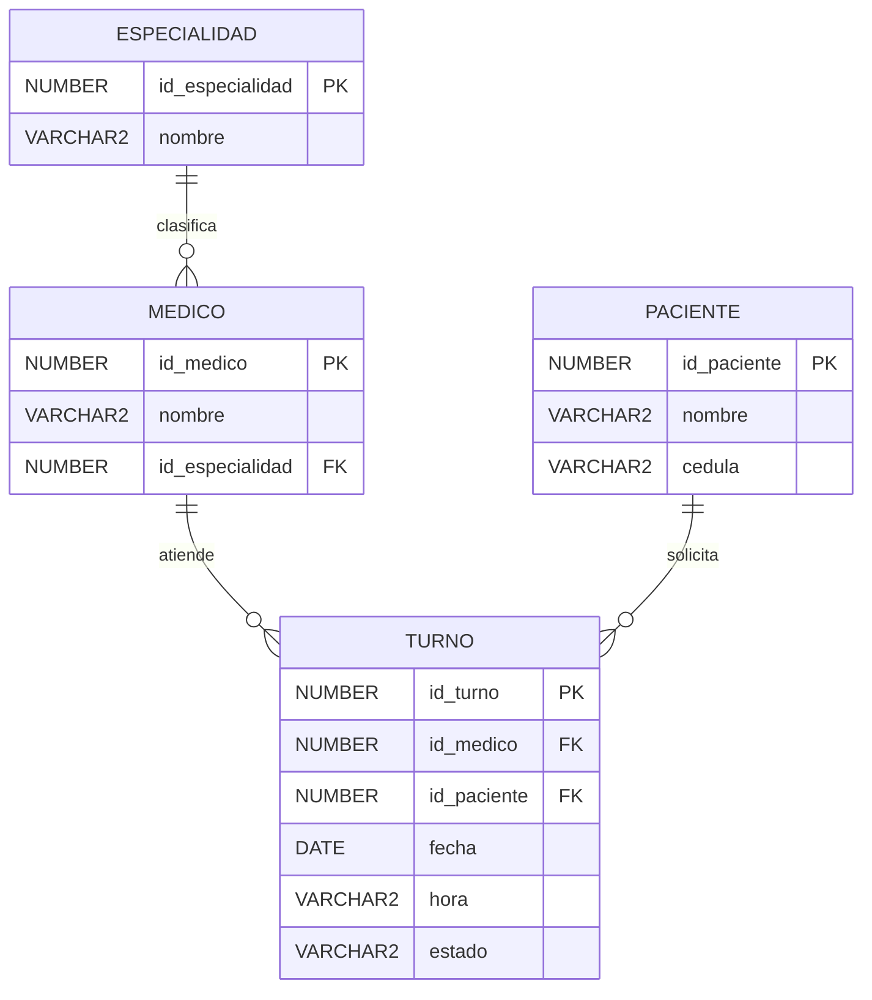

# Plataforma de Turnos Médicos

Reto ABR (Aprendizaje Basado en Retos) de la materia **Diseño y Gestión de Bases de Datos** — cuarto ciclo, Ingeniería en Sistemas, **UCACUE**.

Sistema para consultar médicos, pacientes, especialidades y turnos, con conteos de pacientes por médico (diario / semanal / mensual) y un **asistente de IA** que responde preguntas en lenguaje natural sobre la base de datos.

---

## 📌 Objetivo

Construir una plataforma de gestión de turnos médicos sobre **Oracle Autonomous Database (23ai)** que combine:

- Un **modelo relacional** clásico (4 tablas normalizadas).
- **Modelado híbrido** con *JSON Relational Duality Views* (documentos JSON editables sobre las tablas).
- **API REST automática** vía ORDS (sin backend propio).
- Un **asistente de IA (NLQ)** con Oracle Select AI + Google Gemini.
- Un **dashboard** en HTML/CSS/JS puro que consume los endpoints.

---

## 🧱 Stack tecnológico

| Capa | Tecnología |
|------|------------|
| Base de datos | Oracle Autonomous Database (23ai) en Oracle Cloud |
| Esquema / usuario | `TURNOS_MEDICOS` |
| API REST | ORDS (Oracle REST Data Services) — AutoREST |
| Modelado híbrido | JSON Relational Duality Views |
| IA / NLQ | Oracle Select AI (`DBMS_CLOUD_AI`) con provider **Google Gemini** (`gemini-flash-latest`) |
| Frontend | HTML + CSS + JavaScript puro (sin frameworks), `fetch()` |
| Pruebas de API | Postman |

---

## 🗂 Modelo de datos

Cuatro tablas. `TURNO` es la tabla de hechos que relaciona médicos y pacientes.



- **ESPECIALIDAD** — catálogo de especialidades médicas.
- **MEDICO** — pertenece a una especialidad.
- **PACIENTE** — identificado por cédula.
- **TURNO** — cita entre un médico y un paciente. `estado`: `PENDIENTE` / `ATENDIDO` / `CANCELADO`.

Sobre estas tablas se definen 3 **Duality Views**:

| Duality View | Documento que expone |
|--------------|----------------------|
| `medico_turnos_dv` | Médico → sus turnos → paciente de cada turno |
| `paciente_turnos_dv` | Paciente → sus turnos → médico de cada turno |
| `especialidad_medicos_dv` | Especialidad → sus médicos |

---

## 📁 Estructura del repositorio

```
.
├── sql/
│   ├── 00_setup_completo.sql        ← SCRIPT MAESTRO (reconstruye todo)
│   ├── 01_tablas_e_inserts.sql      Tablas + datos de prueba
│   ├── 02_duality_views.sql         Las 3 Duality Views
│   ├── 03_habilitar_rest.sql        Habilitación ORDS AutoREST
│   ├── 04_select_ai_y_endpoint.sql  Select AI (Gemini) + endpoint /ai/consulta
│   ├── 05_consultas_optimizadas.sql Catálogo de 15 consultas (EXPLAIN PLAN antes/después)
│   └── ejemplos_select_ai.sql       Ejemplos de consultas NLQ (SELECT AI)
├── frontend/
│   └── panel_turnos_medicos.html    Dashboard (4 pestañas)
├── api/
│   ├── postman_coleccion_crud.json           Colección Postman (CRUD)
│   ├── postman_coleccion_con_ejemplos.json   Colección Postman (con ejemplos de respuesta)
│   ├── openapi_medicos_turnos.json           OpenAPI del endpoint médicos
│   ├── openapi_pacientes_turnos.json         OpenAPI del endpoint pacientes
│   └── openapi_especialidades_medicos.json   OpenAPI del endpoint especialidades
├── docs/
│   ├── D5_tabla_consultas_optimizadas.docx   Informe comparativo de consultas
│   └── evidencia_*.odt                        Capturas (Postman, OpenAPI, consultas)
├── .gitignore
└── README.md
```

---

## 🚀 Reconstruir el proyecto paso a paso

> **Credenciales:** recibirás por separado el enlace de acceso a **Database Actions**, así como el usuario y la contraseña del esquema `TURNOS_MEDICOS`. No están en este repositorio público.

### 1. Conectarse a la base de datos

No necesitas descargar ningún wallet ni instalar software adicional: la conexión se hace directamente desde el navegador con **Database Actions**.

1. Abre el enlace de **Database Actions** que se te compartió.
2. Inicia sesión con el usuario `TURNOS_MEDICOS` y la contraseña que recibiste.
3. En el panel de accesos rápidos, abre la tarjeta **SQL** (bajo *Development*). Ahí es donde vas a pegar y ejecutar los scripts de la carpeta `sql/`.

### 2. Ejecutar el script maestro

1. Antes de ejecutar, abrir `sql/00_setup_completo.sql` y, en la **Sección 4**, reemplazar el placeholder `'TU_API_KEY_DE_GEMINI_AQUI'` por tu **API key de Google Gemini** (ver [nota de Select AI](#-nota-sobre-select-ai)).
2. Ejecutar el script **completo, de arriba a abajo**, sobre un esquema limpio. Reconstruye en orden: tablas → datos → Duality Views → habilitación REST → Select AI → endpoint del asistente IA.

> El catálogo `sql/05_consultas_optimizadas.sql` es **analítico** (planes de ejecución) y se ejecuta aparte, sentencia por sentencia, si se desea reproducir la tabla comparativa del informe D5.

### 3. Probar los endpoints REST

Con el esquema habilitado en ORDS, cada Duality View queda disponible en:

```
https://<HOST>/ords/turnos_medicos/medicos-turnos/
https://<HOST>/ords/turnos_medicos/pacientes-turnos/
https://<HOST>/ords/turnos_medicos/especialidades-medicos/
```

Prueba rápida desde la terminal (reemplaza `<HOST>`):

```bash
curl https://<HOST>/ords/turnos_medicos/medicos-turnos/
```

### 4. Importar y usar la colección de Postman

1. Abrir **Postman** → *Import* → seleccionar `api/postman_coleccion_crud.json` (o `postman_coleccion_con_ejemplos.json` para ver respuestas de ejemplo).
2. La colección incluye, por cada recurso, las operaciones **GET (listar)**, **GET por ID**, **POST**, **PUT** y **DELETE**.
3. Si las URLs usan un host distinto al tuyo, ajústalas o define una variable de entorno con tu `<HOST>`.

### 5. Abrir la interfaz

El dashboard está en `frontend/panel_turnos_medicos.html` y consume los endpoints con `fetch()`.

> ⚠️ **No lo abras haciendo doble clic sobre el archivo** (eso lo carga como `file://` y el navegador bloquea las peticiones a los endpoints por CORS). Tiene que servirse desde una URL `http://localhost...`. Cualquiera de estas opciones funciona; usa la que ya tengas disponible:

- **Con VS Code:** instala la extensión **Live Server**, haz clic derecho sobre `panel_turnos_medicos.html` → *"Open with Live Server"* (o el botón *"Go Live"* de la barra inferior). El proyecto ya trae configurado el puerto 5501 en `.vscode/settings.json`.
- **Sin VS Code, con Python instalado:** abre una terminal en la carpeta `frontend/` y ejecuta `python3 -m http.server 5501`. Luego visita `http://localhost:5501/panel_turnos_medicos.html`.
- **Sin VS Code, con Node.js instalado:** desde la carpeta `frontend/` ejecuta `npx serve -l 5501`. Luego visita la URL que te indique la terminal.

Si la instancia que usas tiene un host distinto al configurado, edita la constante `BASE` cerca de la parte superior del `<script>` dentro del HTML y reemplázala por tu propio host.

---

## 🔌 Endpoints disponibles

Base: `https://<HOST>/ords/turnos_medicos/`

| Método(s) | Ruta | Descripción |
|-----------|------|-------------|
| GET / POST / PUT / DELETE | `medicos-turnos/` | CRUD sobre `medico_turnos_dv` |
| GET / POST / PUT / DELETE | `pacientes-turnos/` | CRUD sobre `paciente_turnos_dv` |
| GET / POST / PUT / DELETE | `especialidades-medicos/` | CRUD sobre `especialidad_medicos_dv` |
| POST | `ai/consulta` | Asistente IA (NLQ). Body: `{ "prompt": "cuantos medicos hay" }` → `{ "respuesta": "..." }` |

Para GET por ID añade el identificador: `medicos-turnos/1`.

---

## 🤖 Nota sobre Select AI

El asistente de IA usa **Oracle Select AI** (`DBMS_CLOUD_AI`) con el provider **Google Gemini** (`gemini-flash-latest`).

- Requiere una **API key propia** del provider (Gemini u OpenAI). Consíguela en el panel del proveedor.


---

## 🔐 Seguridad

- Las **credenciales de conexión** al esquema no se publican aquí; se comparten por separado (El informe).

